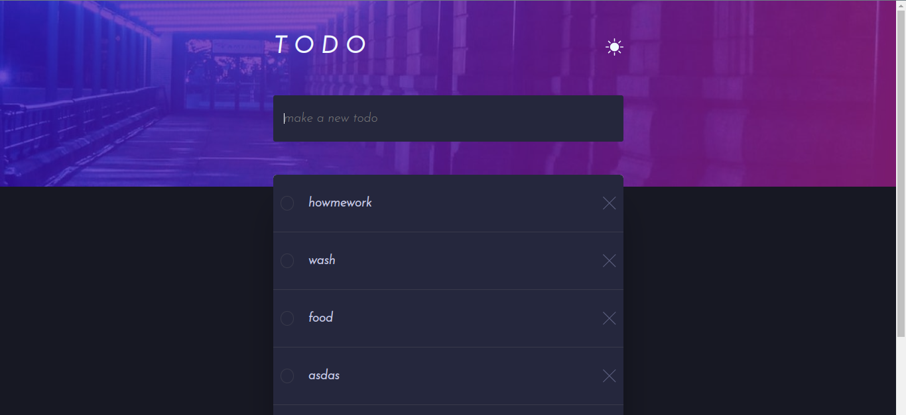

## Overview

### The challenge

Users should be able to:

- View the optimal layout for the app depending on their device's screen size
- See hover states for all interactive elements on the page
- Add new todos to the list
- Mark todos as complete
- Delete todos from the list
- Filter by all/active/complete todos
- Clear all completed todos
- Toggle light and dark mode
- **Bonus**: Drag and drop to reorder items on the list

### Screenshot

### Links

- Solution URL: [Add solution URL here](https://github.com/levaniakobidze/React-Todo-app)
- Live Site URL: [Add live site URL here](https://react-todo-app-levan.vercel.app/)

## My process

### Built with

- Semantic HTML5 markup
- CSS custom properties
- Flexbox
- CSS Grid
- [React](https://reactjs.org/) - JS library
- [Css] - For styles

### What I learned

- I have learnd how to make drag and drop functionality.

## Author

- Website - [Portfolio](https://levaniakobidze.vercel.app/)
- Github - [@LevanIakobidze](https://github.com/levaniakobidze)
- Linkedin - [@yourusername](https://www.linkedin.com/in/levan-iakobidze-b0b60923b/)
